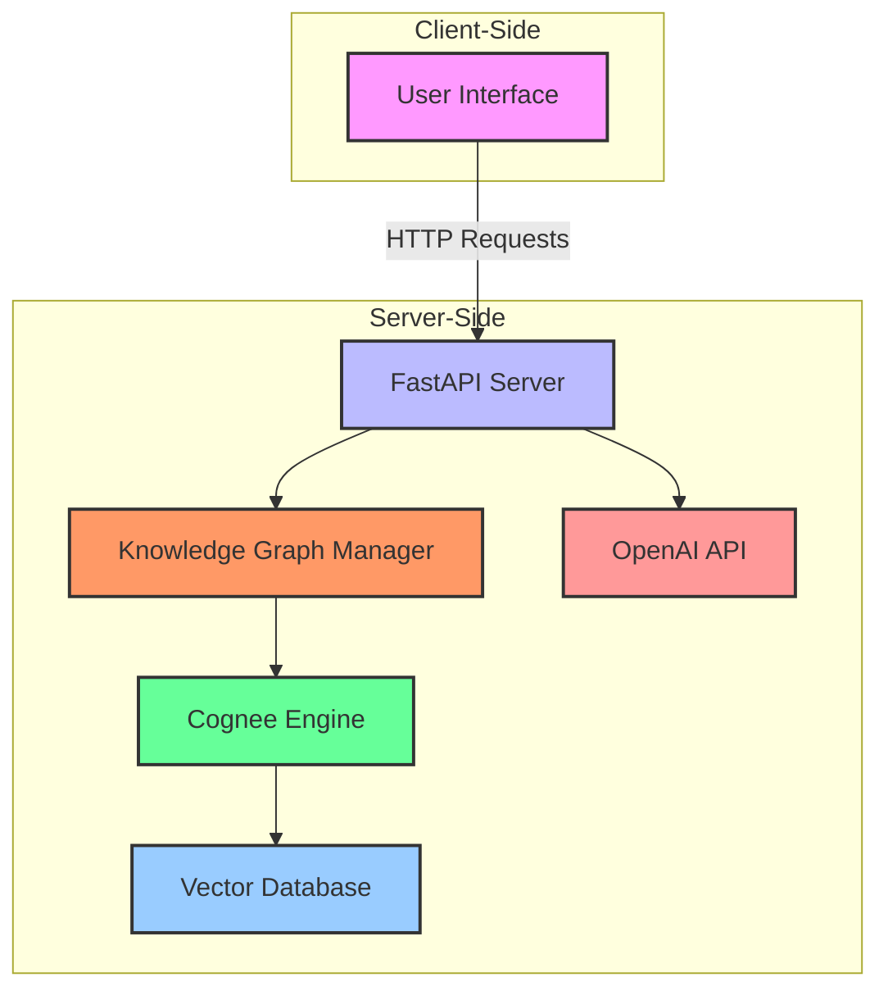
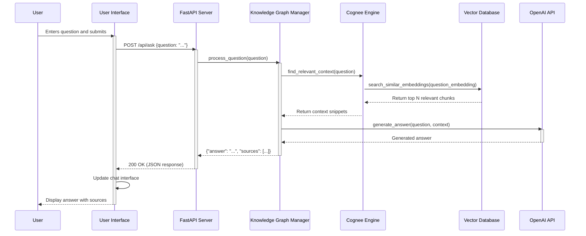
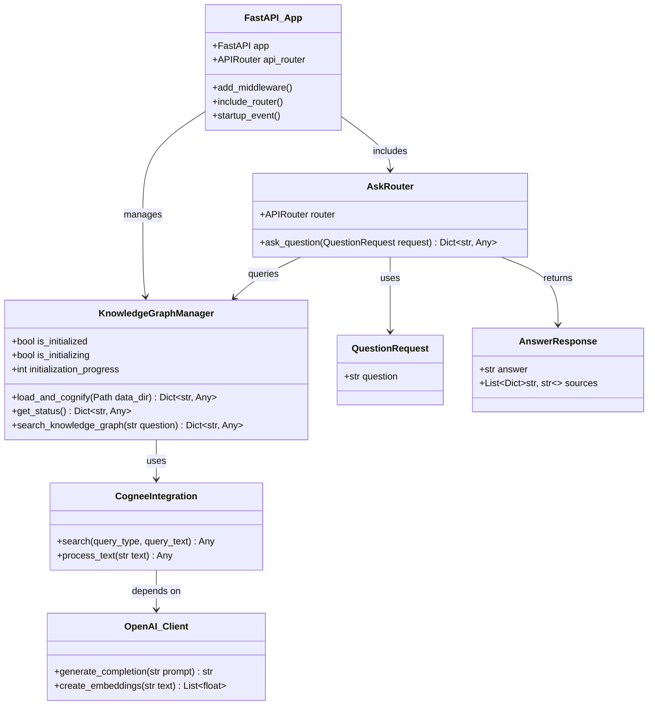

# Harry Potter QnA with Cognee

A question-answering system that uses Cognee's knowledge graph technology to answer questions about the Harry Potter universe. This application processes the text from the Harry Potter books, builds a knowledge graph, and allows for semantic search and question-answering about the content.

## System Architecture



### Architecture Components

1. **User Interface**
   - Built with HTML, CSS, and JavaScript
   - Handles user interactions and displays responses
   - Communicates with the backend via REST API

2. **FastAPI Server**
   - Handles HTTP requests and responses
   - Routes requests to appropriate handlers
   - Manages authentication and API key validation

3. **Knowledge Graph Manager**
   - Orchestrates interactions with the knowledge graph
   - Processes natural language queries
   - Formats responses for the client

4. **Cognee Engine**
   - Processes and indexes text data
   - Builds and maintains the knowledge graph
   - Handles semantic search operations

5. **Vector Database**
   - Stores vector embeddings of text chunks
   - Enables efficient similarity search
   - Maintains relationships between entities

6. **OpenAI API**
   - Provides language model capabilities
   - Generates embeddings for text
   - Assists in natural language understanding and generation

## 🔄 System Interaction Flow

### Sequence Diagram: Question Processing



### Flow Description

1. **User Submission**
   - User enters a question in the web interface
   - UI sends an HTTP POST request to the FastAPI server

2. **Request Processing**
   - FastAPI validates the request and extracts the question
   - Request is forwarded to the Knowledge Graph Manager

3. **Context Retrieval**
   - Knowledge Graph Manager uses Cognee Engine to find relevant context
   - Cognee queries the Vector Database for similar text chunks
   - Most relevant context snippets are returned

4. **Answer Generation**
   - Context and question are sent to OpenAI API
   - OpenAI generates a natural language answer

5. **Response Formulation**
   - Answer is formatted with source references
   - Response is sent back through the chain

6. **UI Update**
   - Web interface updates to show the answer
   - Sources are displayed for reference

## Features

- Processes and indexes Harry Potter book text
- Builds a knowledge graph of characters, locations, and events
- Enables semantic search across the book content
- Provides a simple interface for asking questions about the Harry Potter universe

## Demo

<video controls width="800">
  <source src="demo.mp4" type="video/mp4">
  Your browser does not support the video tag.
</video>

## Dataset

The application uses the complete text from all seven Harry Potter books as its knowledge base. The text is processed and indexed using [Cognee](https://www.cognee.ai/), an open-source framework for building and managing knowledge graphs. For more technical details about the underlying technology, you can read the [Cognee research paper](https://arxiv.org/abs/2505.24478).

The text is processed and indexed to build a comprehensive knowledge graph of the Harry Potter universe.

### Prerequisites

- Python 3.8+
- Node.js (for development)
- OpenAI API key

## 🚀 Getting Started

### Prerequisites
- Python 3.8 or higher
- Git
- OpenAI API key (get one from [OpenAI](https://platform.openai.com/api-keys))

### Setup Instructions

1. **Clone the repository**
   ```bash
   git clone https://github.com/hithesh-mr/harry-potter-qna-with-cognee.git
   cd harry-potter-qna-with-cognee
   ```

2. **Set up Python environment**
   ```bash
   # Create and activate virtual environment
   python -m venv .venv
   
   # On Windows:
   .venv\Scripts\activate
   
   # On macOS/Linux:
   # source .venv/bin/activate
   ```

3. **Install dependencies**
   ```bash
   # Install core requirements
   pip install -r requirements.txt
   
   # Install Cognee SDK (this might take a few minutes)
   pip install cognee==0.1.39
   
   # Install additional required packages
   pip install openai python-dotenv fastapi uvicorn
   
   # If you encounter SSL errors, install certifi:
   # pip install certifi
   ```

4. **Configure environment variables**
   Create a `.env` file in the root directory with your OpenAI API key:
   ```env
   LLM_API_KEY=your_openai_api_key_here
   ```

5. **Run the application**
   ```bash
   # Start the FastAPI server
   uvicorn server.app:app --reload
   ```
   
   The server will start on `http://127.0.0.1:8000`

6. **Initialize the knowledge graph**
   In a new terminal, run:
   ```bash
   curl -X POST http://127.0.0.1:8000/api/initialize
   ```
   
   This will start building the knowledge graph from the Harry Potter books. The first-time initialization may take several minutes.

7. **Access the application**
   Open your web browser and navigate to `http://localhost:8000`
   - The API documentation will be available at `http://localhost:8000/docs`
   - The knowledge graph visualization will be available at `http://localhost:8000/graph`

# 🏛️ Class Structure

## 📘 System Class Diagram



### Key Classes and Their Responsibilities

1. **FastAPI_App**
   - Main application entry point
   - Configures middleware and routes
   - Manages application lifecycle

2. **KnowledgeGraphManager**
   - Manages the knowledge graph lifecycle
   - Handles initialization and status checks
   - Coordinates search operations

3. **QuestionRequest/AnswerResponse**
   - Data models for API request/response
   - Ensure type safety and validation

4. **AskRouter**
   - Handles question-answering endpoint
   - Manages request/response flow
   - Integrates with KnowledgeGraphManager

5. **CogneeIntegration**
   - Wraps Cognee functionality
   - Handles text processing and search
   - Manages vector database interactions

6. **OpenAI_Client**
   - Handles communication with OpenAI API
   - Manages API key and rate limiting
   - Processes text generation requests

## How It Works

### Knowledge Graph Construction

1. **Data Ingestion**: The system processes the complete text of all seven Harry Potter books
2. **Text Processing**: Text is cleaned, tokenized, and split into meaningful chunks
3. **Embedding Generation**: Text chunks are converted to vector embeddings using OpenAI's API
4. **Graph Construction**: Relationships between entities are established to form a knowledge graph

### Question Answering Process

1. The user submits a question through the web interface
2. The question is sent to the FastAPI backend
3. The system searches the knowledge graph for relevant context
4. The context and question are sent to OpenAI's API to generate an answer
5. The answer is formatted and returned to the user

## Project Structure

```
harry-potter-qna-with-cognee/
├── client/                  # Frontend code
│   ├── index.html           # Main HTML file
│   ├── styles.css           # CSS styles
│   ├── scripts.js           # Frontend JavaScript
│   └── logos/               # Image assets
├── server/                  # Backend code
│   ├── app.py               # FastAPI application
│   ├── ask.py               # Question handling
│   ├── knowledge_graph.py   # Knowledge graph management
│   └── __init__.py
├── data/                    # Data files
│   ├── combined_harry_potter.txt
│   └── original/            # Original book texts
├── requirements.txt         # Python dependencies
└── README.md               # This file
```

## API Documentation

### Endpoints

- `GET /api/status`: Check the status of the knowledge graph
- `POST /api/ask`: Submit a question
  - Request body: `{"question": "Your question here"}`
  - Response: `{"answer": "...", "sources": [...]}`

## Performance Considerations

- **Initialization**: The knowledge graph takes time to initialize (5-10 minutes) as it processes all seven books
- **Response Time**: Typical response time is 2-5 seconds depending on query complexity
- **Caching**: Recent queries are cached to improve performance

## Security

- API keys are never exposed to the client
- All communications are encrypted (HTTPS)
- Rate limiting is implemented to prevent abuse

## License

This project is licensed under the MIT License - see the [LICENSE](LICENSE) file for details.

## Acknowledgments

- J.K. Rowling for the Harry Potter series
- OpenAI for their powerful language models
- The Cognee team for their knowledge graph technology

## Usage

1. Ensure your virtual environment is activated
2. Run the application:
   ```bash
   python server/app.py
   ```
3. Access the web interface at `http://localhost:8000`

## Project Structure

- `data/`: Contains the Harry Potter book text files
- `server/`: Backend code for processing and querying the knowledge graph
- `client/`: Frontend web interface (if applicable)
- `playbook/`: Jupyter notebooks for experimentation and development

## Troubleshooting

- If you encounter disk I/O errors, try deleting the `.cognee_system` directory and restarting the application
- Ensure your OpenAI API key has sufficient credits and is properly set in the `.env` file
- Check the logs for specific error messages if the application fails to start
